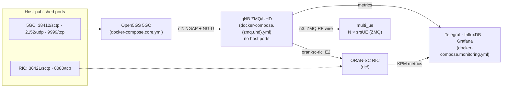

# cudu-deploy

Consolidated deployment for a 5G testbed: **Open5GS 5GC + ORAN-SC Near-RT RIC + srsRAN/OCUDU gNB**, in two flavours — **ZMQ** (virtual RF, fully testable in software) and **UHD** (physical USRP B210).

## Design

The **5GC and RIC publish their ports on the host**, so any number of gNBs — local, in another compose project, or on another machine — can attach. **gNB containers publish nothing**; they reach the core/RIC over shared docker bridges (and, for remote gNBs, the published host ports).



**Networks** (external bridges; `scripts/net_manage.sh init`):

| network | subnet | carries |
|---|---|---|
| `n2` | 10.53.1.0/24 | NGAP (SCTP) + NG-U GTP-U, 5GC ↔ gNB |
| `n3` | 10.10.0.0/16 | ZMQ RF transport, gNB ↔ multi_ue (*not* 3GPP N3) |
| `oran-sc-ric` | 10.0.2.0/24 | E2, gNB ↔ RIC |
| `metrics` | 172.19.1.0/24 | telemetry |

## Layout

```
docker-compose.core.yml        5GC (host ports 38412/sctp, 2152/udp, 9999)
docker-compose.zmq.yml         gNB ZMQ  (no host ports)
docker-compose.uhd.yml         gNB UHD  (no host ports)
docker-compose.monitoring.yml  telegraf + influxdb + grafana (:3300)
open5gs/                       5GC build context (entrypoint provisions sub + UPF NAT)
ric/                           ORAN-SC RIC (host ports 36421/sctp, 8080)
configs/                       gnb_zmq.yml, gnb_uhd.yml + compose overlays
ue/multi_ue/                   N srsUEs in one container (ZMQ)
monitoring/                    telegraf/ + grafana/ build dirs + .env
scripts/                       manage.sh, net_manage.sh, add_user.sh, ...
docs/                          SETUP.md, RUNBOOK_E2E_ZMQ.md
```

## Images
- **gNB** — pulled (`GNB_IMAGE` in `.env`). The OCUDU source is vendored under
  [`src/ocudu/`](src/ocudu) so the image can also be **built locally** (see below).
- **Open5GS** — built locally from `open5gs/` (small, self-contained).
- **RIC** — pulled from `nexus3.o-ran-sc.org` (+ two local builds).
- **multi_ue** — pulled (`ghcr.io/sulaimanalmani/srsranzmq/srsue`).

### Building the gNB image from `src/ocudu`
```bash
docker build -f src/ocudu/docker/Dockerfile \
  --build-arg ENABLE_ZEROMQ=On \
  --build-arg MARCH=x86-64-v4 \
  -t rptestbed/gnb:local src/ocudu
# then set GNB_IMAGE=rptestbed/gnb:local in .env
```
> **MARCH must be ≤ the run host's CPU ISA** or the gNB SIGILLs (exit 132) once the
> PHY runs. `x86-64-v4` works on Cascade Lake; do not build `-march=native` on a
> newer host than the testbed.

## Metrics pub/sub pipeline
xApps publish KPM to **Kafka** (`xapp-metrics`); a **consumer** fans each message to
**InfluxDB 3** (`srsran/kpm`), **MongoDB** (`metrics.kpm`) and **InfluxDB 2**
(`primary/srsran`, AIMLFW-compatible, port 8086). Start with
`./scripts/manage.sh start pubsub`. See `docker-compose.pubsub.yml` and `pubsub/`.

## Quickstart (ZMQ end-to-end)

```bash
./scripts/net_manage.sh init
./scripts/manage.sh start core         # wait healthy (provisions UE #1)
./scripts/manage.sh start ric          # self-heals e2mgr/e2term
./scripts/manage.sh start monitoring
./scripts/manage.sh start gnb          # DEPLOY_TYPE=zmq (default)
./scripts/manage.sh start multi_ue     # NUM_UES=1
```

Full procedure, gates and troubleshooting: **[docs/RUNBOOK_E2E_ZMQ.md](docs/RUNBOOK_E2E_ZMQ.md)**.
Per-component detail and the UHD flow: **[docs/SETUP.md](docs/SETUP.md)**.

## UHD

```bash
# edit .env -> DEPLOY_TYPE=uhd ; set the USRP serial in configs/gnb_uhd.yml
./scripts/net_manage.sh init
./scripts/manage.sh start core
./scripts/manage.sh start ric
./scripts/manage.sh start gnb          # uses the host USRP over USB
```
UE is a real handset (provision IMSI/SD in the WebUI at http://localhost:9999, admin/1423).
