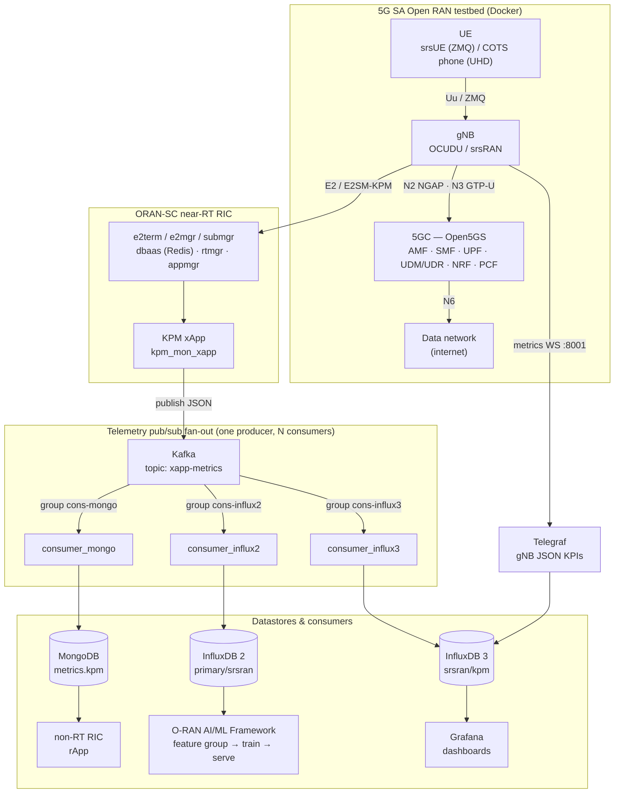
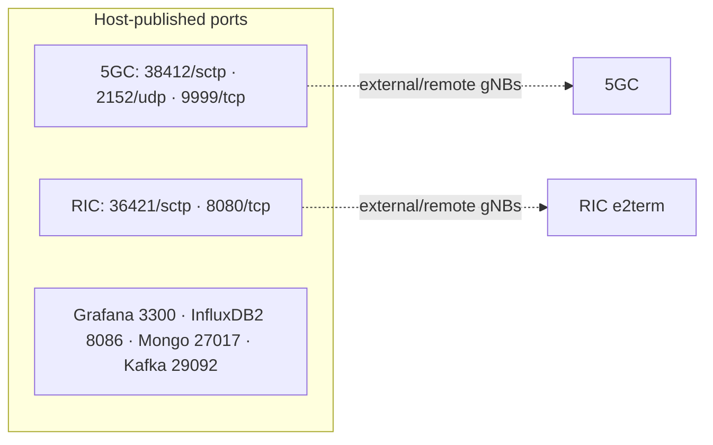
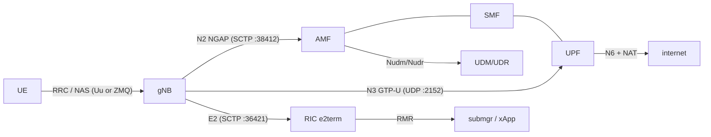
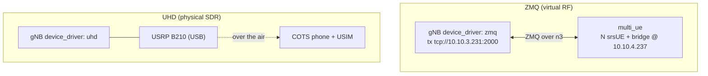
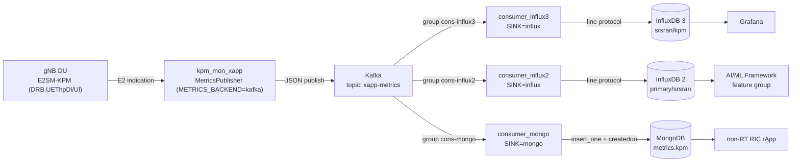
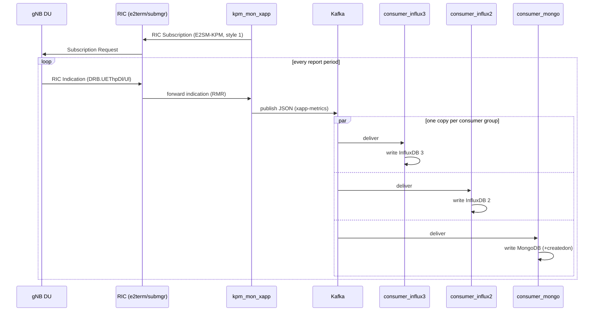
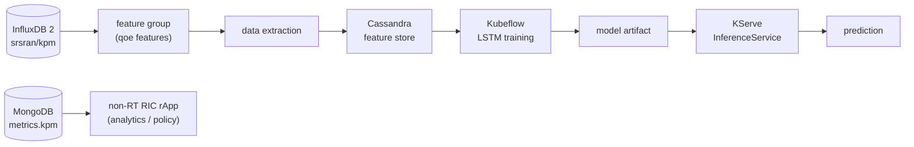

# Architecture

This document describes the complete architecture of the consolidated O-RAN testbed:
a 5G SA Open RAN stack (Open5GS 5GC + ORAN-SC near-RT RIC + OCUDU/srsRAN gNB), a
**publish/subscribe telemetry pipeline** (xApp → Kafka → N purpose-specific consumers),
and the integration points for the **O-RAN AI/ML Framework** and a **non-RT RIC rApp**.

For deployment steps see [SETUP.md](SETUP.md); for the scripted ZMQ end-to-end test see
[RUNBOOK_E2E_ZMQ.md](RUNBOOK_E2E_ZMQ.md).

---

## 1. System overview

The testbed produces RAN telemetry from two independent producers (the gNB's own JSON
metrics, and the KPM xApp over E2), and routes it to consumers. The **telemetry bus**
decouples the single xApp producer from N consumers, each persisting the stream into the
datastore its purpose needs.



**Two highest-value hand-offs:** the **non-RT RIC** (MongoDB → rApp) and the **AI/ML
Framework** (InfluxDB 2 → feature group). Grafana (InfluxDB 3) is the operational view.

---

## 2. Networks and host ports

All components attach to four **external Docker bridges** created by
`scripts/net_manage.sh init` (bridge-only — no macvlan, no host-interface setup).

| Network | Subnet | Carries |
|---|---|---|
| `n2` | `10.53.1.0/24` | NGAP (SCTP) **+ NG-U GTP-U**, 5GC ↔ gNB |
| `n3` | `10.10.0.0/16` | **ZMQ RF transport**, gNB ↔ multi_ue (*not* 3GPP N3) |
| `oran-sc-ric` | `10.0.2.0/24` | E2, gNB ↔ RIC |
| `metrics` | `172.19.1.0/24` | telemetry: telegraf/influx/grafana, Kafka, Mongo, consumer, xApp, UE export |

**Principle:** the 5GC and RIC **publish host ports** so any number of gNBs (local, other
compose projects, remote hosts) can attach; **gNB containers publish nothing** and reach the
core/RIC over the shared bridges (or, for remote gNBs, the host ports).



**Fixed addresses** (defaults in `.env`): 5GC `10.53.1.2`, gNB `10.53.1.3` (n2) /
`10.10.3.231` (n3 ZMQ) / `10.0.2.25` (E2) / `172.19.1.3` (metrics); e2term `10.0.2.10`;
multi_ue `10.10.4.237`. Metrics bridge: telegraf `.4`, InfluxDB 3 `.5`, Grafana `.6`,
Kafka `.7`, Mongo `.8`, consumer `.9`, InfluxDB 2 `.10`, xApp runner `.20`, multi_ue `.23`.

> **Why N3 GTP-U rides `n2`:** in the ZMQ topology the `n3` bridge is the *ZMQ transport
> wire* between gNB and multi_ue. The real 3GPP NG-U GTP-U flows over `n2` (5GC `10.53.1.2`
> ↔ gNB `10.53.1.3`), alongside NGAP.

---

## 3. Components

| Group | Containers | Role |
|---|---|---|
| **Core** | `open5gs_5gc` | 5G SA core (AMF/SMF/UPF/UDM/UDR/NRF/PCF) + internal Mongo subscriber DB; provisioned via `open5gs-dbctl` |
| **RIC** | `ric_e2term`, `ric_e2mgr`, `ric_submgr`, `ric_appmgr`, `ric_rtmgr_sim`, `ric_dbaas` (Redis), `python_xapp_runner` | ORAN-SC near-RT RIC + xApp host (E2SM-KPM/RC/CCC) |
| **gNB** | `ocudu_gnb` | OCUDU/srsRAN gNB (ZMQ or UHD); docker-net only, no host ports |
| **UE** | `multi_ue` | N srsUEs + co-located ZMQ bridge (ZMQ only) |
| **Monitoring** | `telegraf`, `influxdb` (v3), `grafana` | gNB JSON KPIs → InfluxDB 3 → Grafana |
| **Pub/sub** | `kafka`, `metrics_mongo`, `influxdb2`, and three consumers `consumer_mongo` / `consumer_influx2` / `consumer_influx3` | telemetry bus + one consumer per sink (same image, different `SINK`/subscription/DB env) |

Lifecycle is driven by `scripts/manage.sh <start|stop> <core|ric|gnb|multi_ue|monitoring|pubsub|all>`.

---

## 4. Control plane, user plane and E2



- **N2 / E2** are gNB-initiated SCTP → publishing the AMF/e2term host ports is enough for
  remote gNBs (replies return on the association).
- **N3 GTP-U** is bidirectional → the gNB shares the `n2` bridge with the UPF so downlink
  GTP-U can reach the gNB's advertised address.
- **Subscriber provisioning** uses canonical `open5gs-dbctl` (raw Mongo inserts produce
  documents the UDR rejects at registration — see [SETUP.md](SETUP.md)).

### RF variants



---

## 5. Telemetry pub/sub pipeline

The KPM xApp publishes each E2SM-KPM indication **once** to Kafka; **three independent
consumers** (same image, different `SINK` + subscription + DB params, each in its own Kafka
**consumer group** so every consumer receives every message) fan it out to three datastores.
Producers and consumers are decoupled — a new purpose is added by attaching another consumer,
with no change to the xApp.



**Each consumer is configured by env** — subscription: `KAFKA_BOOTSTRAP_SERVERS`,
`KAFKA_TOPIC`, `KAFKA_GROUP_ID`, `KAFKA_OFFSET_RESET`; output: `SINK` (`influx`\|`mongo`) plus the
sink's DB params (`INFLUX_URL`/`INFLUX_BUCKET`/`INFLUX_ORG`/`INFLUX_TOKEN`, or
`MONGO_URI`/`MONGO_DB`/`MONGO_TIMEOUT_MS`). Implementation: `pubsub/consumer/consumer.py`
(generic Kafka loop) + `sinks.py` (pluggable `InfluxSink`/`MongoSink`, registered in `SINKS`);
the three services share one image via YAML anchors in `docker-compose.pubsub.yml`. Adding a
sink = a class in `sinks.py` + a service block.

**Message schema** (JSON on `xapp-metrics`):

```json
{
  "measurement": "kpm",
  "tags": { "e2_node_id": "gnbd_001_001_000001_0", "report_style": 1, "ue_id": "cell" },
  "fields": { "DRB_UEThpDl": 414.0, "DRB_UEThpUl": 407.0 },
  "timestamp_ns": 1782076183419887502,
  "xapp": "kpm"
}
```

**Per-consumer persistence:**

| Sink | Target | Notes |
|---|---|---|
| InfluxDB 3 | `srsran/kpm` (line protocol, `/api/v2/write`) | Grafana feed; dots → underscores in field keys |
| InfluxDB 2 | `primary/srsran`, measurement `kpm` (port 8086, token-auth) | **same version the AIMLFW uses**; data written *as-is* |
| MongoDB | `metrics.kpm` | full document + `ingested_at_ns` + **`createdon`** (xApp created-at as UTC ISO string, fallback `now(UTC)`) |

Producer: `ric/xApps/python/lib/metrics_publisher.py` + factory `metrics_writer.py`.
Consumers: one image (`pubsub/consumer/consumer.py` + `sinks.py`, vendoring `influx_writer.py`)
run as three services in `docker-compose.pubsub.yml`.

### End-to-end KPM sequence



---

## 6. Downstream integration

- **O-RAN AI/ML Framework (AIMLFW).** The InfluxDB 2 sink (`primary/srsran`, token-compatible)
  is exactly the datastore the AIMLFW reads. Live KPM lands there continuously, so the same
  **feature-group → data-extraction → Kubeflow training → KServe serving** lifecycle the
  AIMLFW already runs applies to live data (not only the `cells.csv` bootstrap). Point a
  feature group at bucket `srsran`, measurement `kpm`, fields `DRB_UEThpDl`/`DRB_UEThpUl`.
- **Non-RT RIC.** The MongoDB collection `metrics.kpm` is the hand-off for a non-RT RIC
  **rApp**: a non-real-time analytics/control loop reads the document store (each record
  carries `createdon`), e.g. to drive policy back toward the near-RT RIC.



---

## 7. Build and deploy notes

- **gNB image:** pulled by default (`GNB_IMAGE`); the OCUDU source is vendored at
  `src/ocudu/` and can be built locally with
  `docker build -f src/ocudu/docker/Dockerfile --build-arg ENABLE_ZEROMQ=On --build-arg MARCH=x86-64-v4 -t <tag> src/ocudu`.
  **`MARCH` must be ≤ the run host's CPU ISA** or the gNB SIGILLs (exit 132) once the PHY runs.
- **Config schema coupling:** the OCUDU `docker-gnb` image uses **plural** `addrs`/`bind_addrs`;
  the srsRAN `gnb` image uses **singular** `addr`/`bind_addr` (see comments in
  `configs/gnb_zmq.yml`).
- **Open5GS / RIC:** 5GC built from `open5gs/`; RIC mostly pulled from `nexus3.o-ran-sc.org`.
- **Start order (full stack):** `net_manage.sh init` → `manage.sh start core` (provision UEs)
  → `start ric` (self-heals e2mgr/e2term) → `start monitoring` → `start pubsub` →
  `start gnb` → `start multi_ue`. Restart order matters: **RIC before gNB** (the gNB sets up
  E2 once and does not auto-reconnect).
